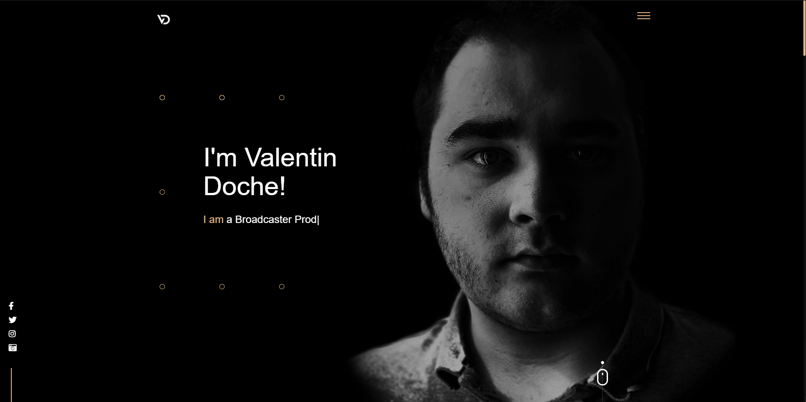

[![Issues][issues-shield]][issues-url]
[![MIT License][license-shield]][license-url]
[![LinkedIn][linkedin-shield]][linkedin-url]

<!-- PROJECT LOGO -->
 

  

<h3 align="center">Valentin Doche WebSite</h3>

  

    Transform static Html Website with blog section and admin dashboard
     
     
    <a href="https://github.com/valentindoche/valentin-doche-website/issues">Report Bug</a>
    ·
    <a href="https://github.com/valentindoche/valentin-doche-website/issues">Request Feature</a>
  

<!-- ABOUT THE PROJECT -->
## About The Project

### Built With

* [PHP]()
* [BOOTSTRAP]()
* [MATERIALIZECSS]()
* [TINYMCE]()
* [JQUERY]()

<!-- LICENSE -->
## License

Distributed under the AGPL-3.0 License. See `LICENSE` for more information.

<!-- CONTACT -->
## Contact

Valentin Doche - [@valetindoche](https://twitter.com/valentindoche) - pro@valentindoche.com

Project Link: [https://github.com/valentindoche/valentin-doche-website](https://github.com/valentindoche/valentin-doche-website)

<!-- MARKDOWN LINKS & IMAGES -->
<!-- https://www.markdownguide.org/basic-syntax/#reference-style-links -->
[issues-shield]: https://img.shields.io/github/issues/valentindoche/valentin-doche-website.svg?style=for-the-badge
[issues-url]: https://github.com/valentindoche/valentin-doche-website/issues
[license-shield]: https://img.shields.io/github/license/valentindoche/valentin-doche-website.svg?style=for-the-badge
[license-url]: https://github.com/valentindoche/valentin-doche-website/blob/master/main/LICENSE
[linkedin-shield]: https://img.shields.io/badge/-LinkedIn-black.svg?style=for-the-badge&logo=linkedin&colorB=555
[linkedin-url]: https://linkedin.com/in/valentindoche
